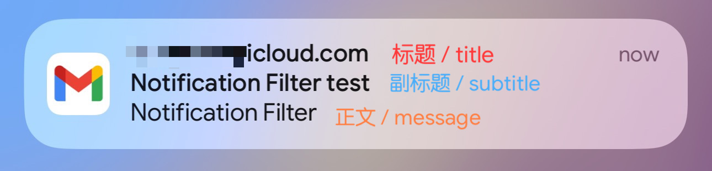

[中文](./README.md) | [English](./README_EN.md)

`Notification Filter` is a notification filtering tweak for jailbroken devices.

It is useful for scenarios like:

- Disabling notifications for pinned messages in specific Telegram groups
- Filtering notifications that contain certain keywords
- Blocking promotional notifications in apps that do not let you turn them off

---

## Features

### 1. Global Rules + Per-App Rules

- Matching order:

  **Global Rules** --> **Per-App Rules**

  If an **exclude rule** is matched, the notification will be allowed immediately.

### 2. Rule Types

- **Include Rules**
- **Exclude Rules**
- **Regex Rules**

### 3. Match Scope

Each rule can specify the match scope:

- Body / `message`
- Title / `title`
- Subtitle / `subtitle`
- All text

Below is an example using an email notification:

### 4. Notification Center Cleanup

You can optionally enable **Remove filtered notifications from Notification Center**:

- When enabled, filtered notifications will be removed from Notification Center
- When disabled, previously filtered notifications will reappear in Notification Center after the tweak is turned off and the device session is restarted

### 5. Filtered Notification Logs

Built-in **Filtered Notifications** page, with support for:

- Searching by app, rule, and notification content
- Viewing the matched rule, timestamp, app, and notification details

### 6. Rule Import / Export

Supports exporting the current configuration to JSON and importing from JSON:

- Export to file
- Copy configuration JSON
- Import from clipboard
- Manually paste JSON to import

Useful for backing up, migrating, and sharing rules.

If this tweak can filter notifications, it could also be extended to recognize SMS or email verification codes and copy them quickly.
